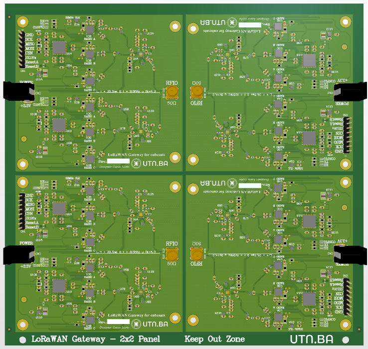

# This folder contains all the hardware related files.

The following images are a preview of the final PCB, and its panel. 

## Design files

  
  
Figure 1: Altium Designer view for the top leyer of the PCB layout.

  
  
Figure 2: Altium Designer view for the bottom leyer of the PCB layout.

## 3D Renders

  
  
Figure 3: 3D render of the top view.

  
  
Figure 4: 3D render of the bottom view.

## Panel 3D render

  
  
Figure 5: 3D render of the fianl panel.

