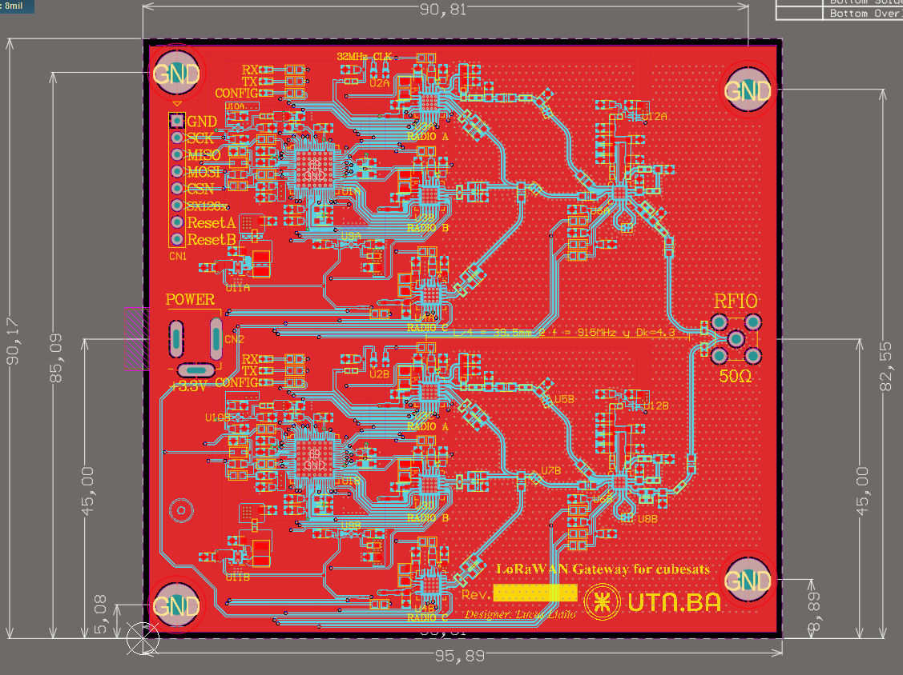
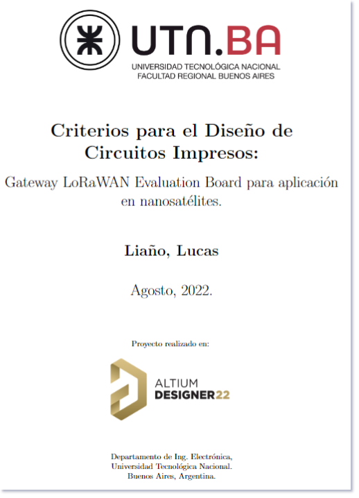

<!--
*** To avoid retyping too much info. Do a search and replace for the following:
*** lorawan_cubesat, LoRaWAN Gateway for cubesat mission, project_description
-->


<!-- PROJECT LOGO -->
<br />
<p align="center">
  <a href="https://github.com/lucasliano/lorawan_cubesat">
    
  </a>

  <h2 align="center">LoRaWAN Gateway:</h3>
  <h3 align="center">Design Criteria for Cubesat Mission</h2>
  

  <p align="center">
    Cubesat submodule development for a LoRaWAN Gateway capable of operating in harsh environments.
    This project has available not only the design files, but also a report describing the design criteria used. 
    <br />
    <a href="https://github.com/lucasliano/lorawan_cubesat/blob/master/report_spanish.pdf"><strong>Explore the docs »</strong></a>
    <br />
    <br />
    <a href="https://github.com/lucasliano/lorawan_cubesat/tree/master/HW">View Demo</a>
    ·
    <a href="https://github.com/lucasliano/lorawan_cubesat/issues">Report Bug</a>
    ·
    <a href="https://github.com/lucasliano/lorawan_cubesat/issues">Request Feature</a>
  </p>
</p>


<!-- TABLE OF CONTENTS -->
<details open="open">
  <summary><h2 style="display: inline-block">Table of Contents</h2></summary>
  <ol>
    <li><a href="#about-the-project">About The Project</a></li>
    <li><a href="#getting-started">Getting Started</a></li>
    <li><a href="#contributing">Contributing</a></li>
    <li><a href="#license">License</a></li>
    <li><a href="#contact">Contact</a></li>
    <li><a href="#acknowledgements">Acknowledgements</a></li>
  </ol>
</details>


<!-- ABOUT THE PROJECT -->
## About The Project

The project was presented as the final assignament of the subject _Introduction to the design of Printed Circuit Boards_, in the _Electronics Engineering_ carrear at the _Universidad Tecnológica Nacional_ located in Buenos Aires, Argentina.

The main goal of the project was to described the design criteria used in the implementation of the layout, while desiging for manufacturing. As the project was develop in less than 2 month, which you can verify looking at the history of this repo, the scope was modified.

I'm still learning about these topics. If you find something wrong in the design, please let me know. I will be grateful at any feedback received.

In this project you will find the `Altium Designer` project files:

<p align="center">
  <a href="https://github.com/lucasliano/lorawan_cubesat/tree/master/HW">
  
  </a>
  <p align="center" style="font-size:0.75em;">Figure 1: Altium Designer view for the top leyer of the PCB layout.</p>
</p>

As well as a report containing all the details of the development. Unfortunately, this report is only available in spanish. If you are an english-speaker, please contact me if you have any concerns. 

<p align="center">
  <a href="https://github.com/lucasliano/lorawan_cubesat/blob/master/report_spanish.pdf">
  
  </a>
  <p align="center" style="font-size:0.75em;">Figure 2: Report cover.</p>
</p>


<!-- GETTING STARTED -->
## Getting Started

This project was develop using Altium Designer 22. The project folder is '_HW/lorawan_gateway_'.

Cloning the repo will be enough to explore the design files. You will need an Altium Designer license

   ```sh
   git clone https://github.com/lucasliano/lorawan_cubesat.git
   ```

<!-- CONTRIBUTING -->
## Contributing

Contributions are what make the open source community such an amazing place to be learn, inspire, and create. Any contributions you make are **greatly appreciated**.

1. Fork the Project
2. Create your Feature Branch (`git checkout -b feature/AmazingFeature`)
3. Commit your Changes (`git commit -m 'Add some AmazingFeature'`)
4. Push to the Branch (`git push origin feature/AmazingFeature`)
5. Open a Pull Request

See the [open issues](https://github.com/lucasliano/lorawan_cubesat/issues) for a list of proposed features (and known issues).

<!-- LICENSE -->
## License

Distributed under the MIT License. See `LICENSE` for more information.

However, I would appreciate if you tell me in case find this information helpful (or not).


<!-- CONTACT -->
## Contact

[Lucas Liaño](https://www.linkedin.com/in/lucas-lia%C3%B1o/) - lliano@frba.utn.edu.ar

Project Link: [https://github.com/lucasliano/lorawan_cubesat](https://github.com/lucasliano/lorawan_cubesat)


<!-- ACKNOWLEDGEMENTS -->
## Acknowledgements

* [Semtech SX1302 Reference Design files](https://www.semtech.com/products/wireless-rf/lora-core/sx1302cssxxxgw1)